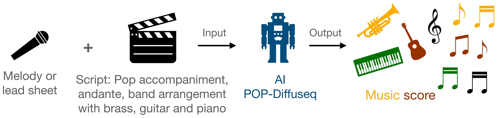
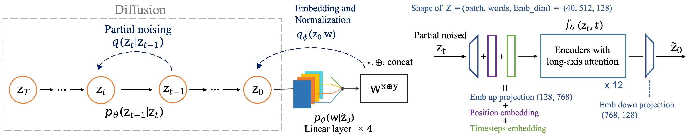
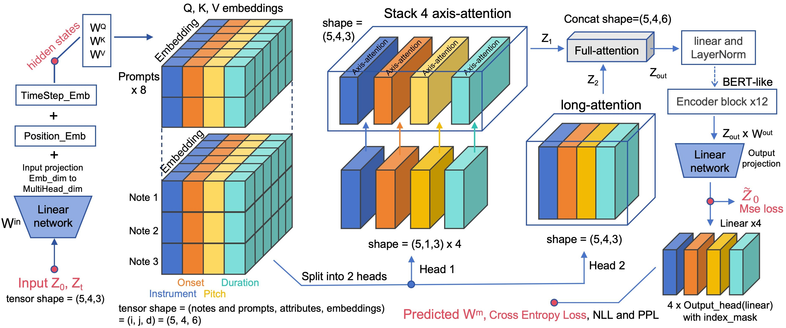
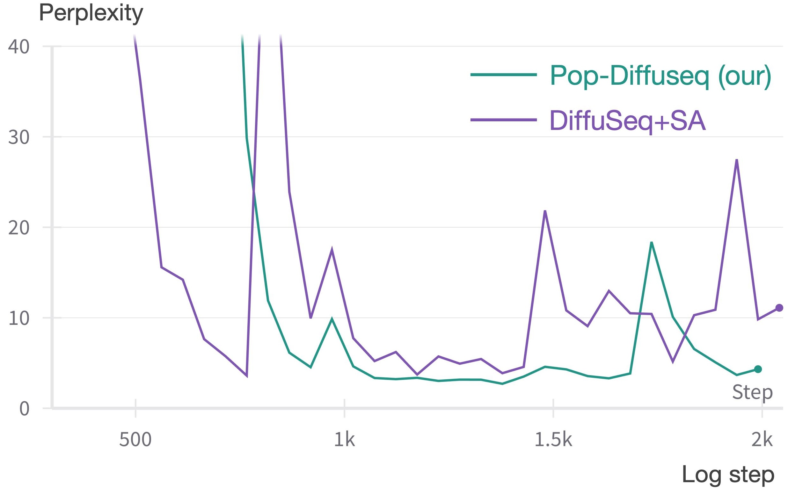
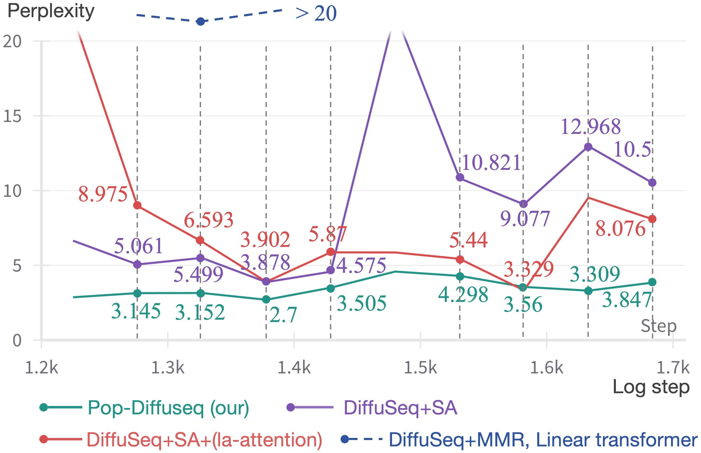

## Overview
Official Codebase for Pop-Diffuseq: A Controllable and Efficiency Method for Musical Accompaniment Generation with Long-Axis Attention

The main function is controllable and interactive symbolic(MIDI) music generation.
The input and output of Pop-Diffuseq are:

<p align = "center">

</p>
<p align = "center">
Accompaniment Generation under Text Prompts.
</p>

The diffusion process of our conditional framework.
<p align = "center">

</p>
<p align = "center">
The framework and diffusion process of Pop-Diffuseq.
</p>

## Data and trained model
The trained models, datasets and all unfiltered samples can be downloaded in Google Drive:
https://drive.google.com/drive/folders/1OWI_sfYmYn2gB13KccO9kkXCP2x8Z-1x?usp=drive_link

Please download from Google Drive as the file is too large.

Due to the high economic cost of our self-built data set MidiPopBand3k, 
we only disclosed part of the data demonstration during the review stage. 
Once the paper is accepted, we will release all the data for free immediately.

## Characteristics
The implement baseline are DiffuSeq:
[*__*DiffuSeq*__: Sequence to Sequence Text Generation With Diffusion Models*](https://arxiv.org/abs/2210.08933).

We improve the basic DiffuSeq in several methods:
(1) long-axis attention;
(2) structure-aligned representation;
(3) dynamic masking;
(4) multi-head output module.

The computational process of long-axis attention algorithm are:

The diffusion process of our conditional framework.
<p align = "center">

</p>
<p align = "center">
computational process of long-axis attention
</p>

## Objective evaluation:
Model setting:

(1) SA: Our proposed Structure-Aligned representation.

(2) MMR: Multi-track Multi-instrument Repeatable representation proposed by SymphonyNet, it is the baseline method of our representation.

(3) DiffuSeq: Discrete diffusion model(Version 2) for text generation, the baseline framework of our model.

(4) la-attention: Our proposed long-axis attention.

(5) linear transformer: Commonly used efficient attention for music generation tasks.

perplexity results:

<p align = "center">

</p>
<p align = "center">
PPL curve for total stage
</p>

<p align = "center">

</p>
<p align = "center">
PPL curves of all settings in the stable phase
</p>

## Setup:
The code is based on PyTorch and HuggingFace `transformers`.
```bash 
pip install -r requirements.txt
```

## DiffuSeq Training
```bash
cd scripts
bash train.sh
```
Arguments explanation:
- ```--dataset```: the name of datasets, just for notation
- ```--data_dir```: the path to the saved datasets folder, containing ```train.jsonl,test.jsonl,valid.jsonl```
- ```--seq_len```: the max length of sequence $z$ ($x\oplus y$) Default 512
- ```--resume_checkpoint```: if not none, restore this checkpoint and continue training
- ```--vocab```: the tokenizer is initialized using bert or load your own preprocessed vocab dictionary

### Update: Additional argument

- ```--learned_mean_embed```: set whether to use the learned soft absorbing state.
- ```--denoise```: set whether to add discrete noise
- ```--use_fp16```: set whether to use mixed precision training
- ```--denoise_rate```: set the denoise rate, with 0.5 as the default

## Speed-up Decoding
We customize the implementation of [DPM-Solver++](https://github.com/LuChengTHU/dpm-solver) to DiffuSeq to accelerate its sampling speed.
```bash
cd scripts
bash run_decode_solver.sh
```
